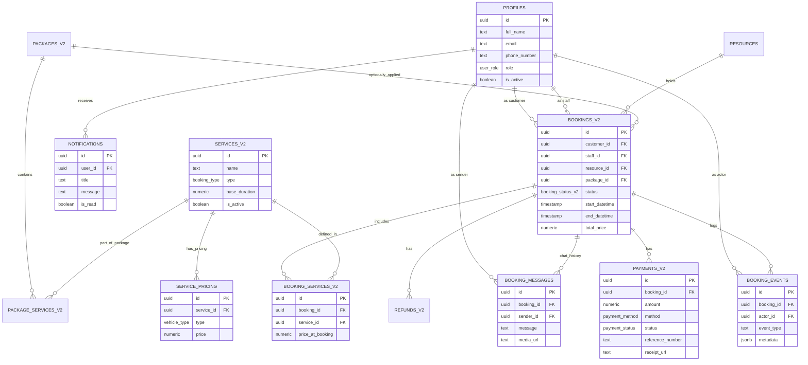

# RENEW: Entity Relationship Diagram (ERD)
## Database Architecture (v2)

This diagram represents the current relational structure of the RENEW Auto Detailing platform.

### Key Relationships Summary:
1.  **Profiles (Users)**: Central entity for Customers, Staff, and Admins.
2.  **Bookings_v2**: The heart of the system, connecting Customers, Staff, and Resources.
3.  **Resource Management**: Every booking is tied to a specific `resource` (detailing bay), which is used for collision detection.
4.  **Flexible Pricing**: `services_v2` are mapped through `service_pricing` to handle different costs for Sedans vs SUVs.
5.  **Audit & Trail**: `booking_events` tracks all lifecycle changes for transparency.
