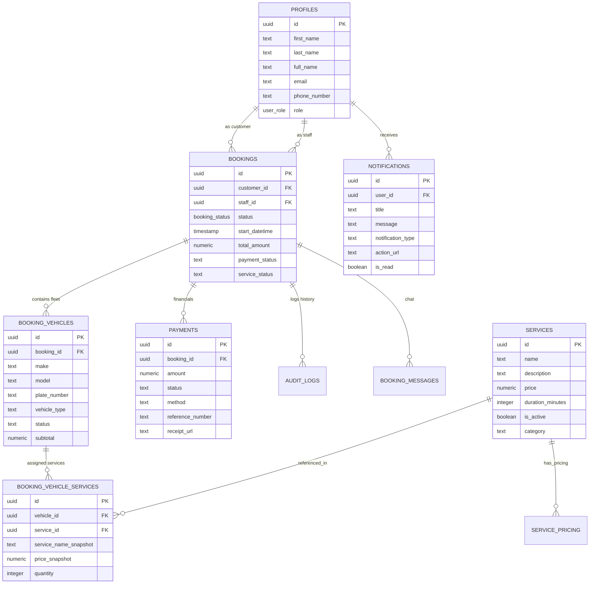

# Seedway Auto x Moto Detail Studio: Entity Relationship Diagram (ERD)
## Production Database Architecture (Standardized)

This diagram represents the stabilized nested relational structure implemented for production-grade stability.

### 🧬 Architectural Hierarchy:
1.  **Booking (Layer 1)**: The parent appointment. Handles scheduling, total pricing (`total_amount`), and customer association.
2.  **Vehicle (Layer 2)**: The unit-level detailing job. Each unit has its own status (`queued`, `in_progress`, `completed`).
3.  **Service (Layer 3)**: The specific work items performed on each vehicle. Stores snapshots of price/name at the time of booking to ensure historical audit integrity.
4.  **Payments**: Independent financial layer that tracks multiple payment attempts (Cash, GCash, etc.) against the booking total.
5.  **Audit Logs**: Comprehensive event tracking for every mutation across the studio operations.
